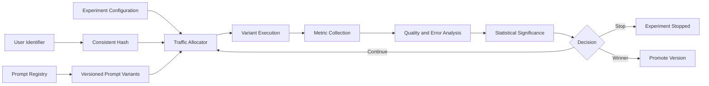

# 🧪 Prompt Experiment Platform

### Prompt Versioning, Controlled Traffic Allocation, and Statistical Evaluation

**A production-oriented control system for versioning prompts and evaluating competing variants under real traffic.**

---

## Overview

The Prompt Experiment Platform treats prompts as versioned production artefacts.

It provides a prompt registry, immutable version history, variable validation, controlled experiment creation, deterministic user assignment, traffic distribution, metric collection, statistical analysis, automatic safety stopping, and winner promotion.

The same user remains assigned to the same variant throughout an experiment, preventing inconsistent experiences and contaminated measurements.

## Architecture

## Core Capabilities

| Capability | Description |
|---|---|
| Prompt registry | Stores prompt definitions as managed assets |
| Version history | Preserves immutable prompt revisions and change metadata |
| Prompt comparison | Displays differences between versions |
| Template validation | Ensures required runtime variables are available |
| Multi-variant experiments | Supports two or more active prompt variants |
| Traffic allocation | Applies configurable percentage distribution |
| Consistent assignment | Uses deterministic hashing for stable user bucketing |
| Metric collection | Records quality, latency, error, and custom observations |
| Statistical analysis | Evaluates whether measured differences are significant |
| Automatic stopping | Stops variants that exceed safety or error thresholds |
| Winner promotion | Promotes the selected prompt without rewriting application code |
| Audit history | Records activation, rollback, experiment, and promotion events |

## Experiment Lifecycle

| Stage | Description |
|---|---|
| Draft | A prompt version is created and validated |
| Active | The version becomes available for experiments |
| Experiment | Traffic is distributed across selected variants |
| Monitoring | Metrics and safety thresholds are evaluated |
| Decision | Continue, stop, or select a winner |
| Promotion | The selected version becomes the active default |
| Rollback | A previous stable version can be restored |

## Engineering Highlights

- Stable SHA-256 user bucketing
- Configurable traffic percentages
- Immutable prompt versioning
- Template-variable validation
- Metric event storage
- Error-rate safety controls
- Statistical significance analysis
- Winner-promotion workflow
- Rollback audit history
- FastAPI control-plane service
- Streamlit experiment dashboard
- Deterministic offline experimentation

## Technology Stack

| Layer | Technology |
|---|---|
| API | FastAPI |
| Validation | Pydantic |
| Storage | SQLite |
| Statistical analysis | Python numerical utilities |
| Dashboard | Streamlit |
| Configuration | Environment variables and structured models |
| Deployment | Docker |
| Testing | Pytest |

## Design Principles

1. Prompts should be versioned with the same discipline as source code.
2. User assignment must remain stable throughout an experiment.
3. Quality, errors, and latency should be measured together.
4. Experiments require safety stopping conditions.
5. Promotion and rollback decisions must remain auditable.

## Security

- Experiment identifiers should not expose private user data.
- Provider credentials remain outside version control.
- User identifiers should be hashed or pseudonymised.
- Sensitive prompt content should be access-controlled.
- Experiment administration endpoints should require authentication in production.

## License

This project is licensed under the [MIT License](LICENSE).

**Prompt Experiment Platform — controlled prompt evolution backed by measurable evidence.**

