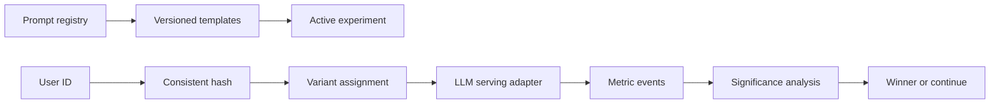

<div align="center">

# Prompt Experiment Platform

### Version prompts, split traffic, and select statistically supported winners

[](https://www.python.org/)
[](https://fastapi.tiangolo.com/)
[](https://www.docker.com/)
[](LICENSE)

</div>

---

## Overview

Treats prompts as versioned production artifacts, supports template variables and rollback, assigns users consistently across multiple variants, records custom metrics, and reports whether observed differences are statistically significant.

## Core capabilities

| Capability | Implementation |
|---|---|
| Prompt registry | Version history, commit messages, diffs, and activation audit. |
| Template validation | Runtime variable substitution for versioned templates. |
| Experiments | Two or more variants with configurable traffic splits. |
| Consistent assignment | Stable SHA-256 user bucketing. |
| Metrics | Quality, error, and custom numeric observations. |
| Decision engine | Z-score significance and winner declaration. |

## Architecture



## Quick start on Windows

```powershell
py -3.11 -m venv .venv
.\.venv\Scripts\Activate.ps1
python -m pip install --upgrade pip
pip install -e ".[dev,dashboard]"
Copy-Item .env.example .env
pytest -q
prompt-lab seed
prompt-lab serve
```

API documentation: `http://localhost:8609/docs`

## Docker

```powershell
Copy-Item .env.example .env
docker compose up --build
```

## Repository layout

```text
src/        application and domain logic
tests/      automated tests
data/       safe sample inputs and seed data
dashboard/  Streamlit review and analytics UI
scripts/    seed, evaluation, and demo commands
docs/       architecture notes
```

## Configuration and safety

- The default mode is offline and uses deterministic demo adapters.
- Cloud providers are optional and require keys placed only in `.env` or repository secrets.
- Sample data is synthetic. Do not upload private production logs or documents.
- Run `pytest -q` before every push.

Run `prompt-lab seed` to create a completed sample experiment. The platform uses a deterministic demo response so experimentation logic can be tested without an API key.

## License

[MIT](LICENSE)
